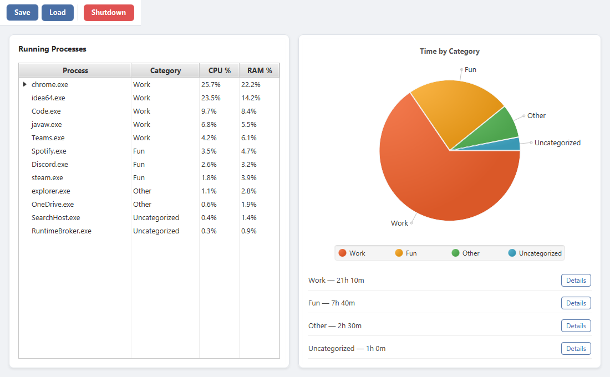
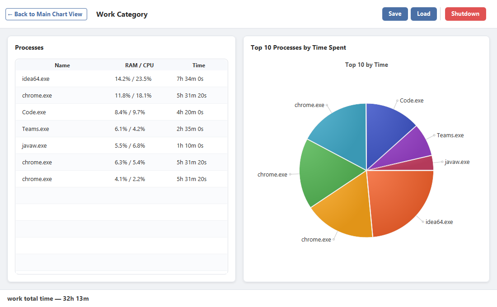
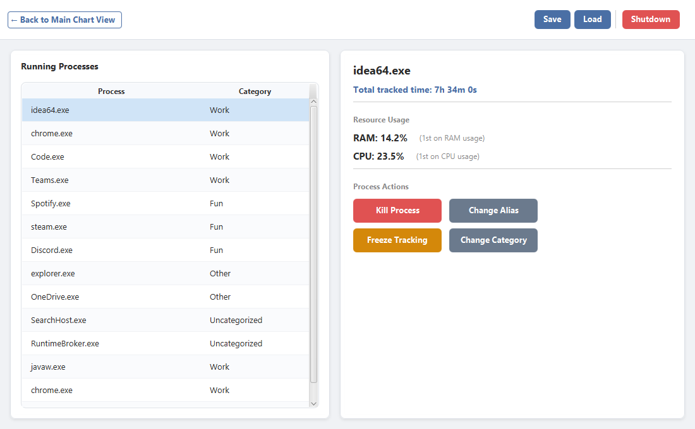

# Productivity Buddy

A desktop process monitor and time tracker for Windows, built with **JavaFX 21** and **Java 21**.
Productivity Buddy scans your running processes in real time, shows live CPU and RAM usage, and
tracks how much time you spend in each application — grouped into categories like **Work**, **Fun**,
and **Other** — so you can see where your day actually goes.



## Features

- **Live process monitoring** — scans all OS processes every couple of seconds (via [OSHI](https://github.com/oshi/oshi)),
  reporting per-process CPU % and RAM %. Multiple instances of the same executable (e.g. `chrome.exe`) are
  grouped into a collapsible row in the process tree.
- **Time tracking** — accumulates the time each application stays alive and persists it across sessions to
  `process_info.json`. Tracking can be **frozen** per-process when you don't want an app to count.
- **Categorization** — assign each process to **Work**, **Fun**, **Other**, or leave it **Uncategorized**.
  A pie chart breaks down your total tracked time by category.
- **Per-category drill-down** — open any category to see every process in it and the **top 10 by time spent**.
- **Process actions** — from the detail view you can **kill** a process, give it a friendlier **alias**,
  **freeze** its time tracking, or **change its category**.
- **Save / Load mappings** — export your category and alias setup to a JSON file and reload it later.
- **Live external reload** — a file watcher detects changes to `process_info.json` on disk and applies them
  to the UI without a restart.
- **Periodic snapshots** — usage snapshots are written out on an interval (and at configurable fixed times)
  for later analysis.
- **Graceful shutdown** — closing the window flushes all tracked time to disk before the app exits, so no
  data is lost.

## Screenshots

### Main chart view
The running-process tree with live CPU/RAM, alongside the time-by-category pie chart and per-category totals.


### Category detail view
All processes in a category, with the top 10 by tracked time.



### Process detail view
Resource usage and rankings for a single process, plus the kill / alias / freeze / category actions.



## Architecture

The UI runs on the JavaFX Application Thread, while all data collection happens on dedicated background
schedulers. Data crosses the thread boundary as **immutable snapshots**, so the UI and background threads
never share mutable state.

```
ProcessScannerService ──▶ MainChartView ──▶ AnalyticsService ──▶ pie chart / category views
   (OSHI, ForkJoinPool)     (FX thread)        (lock-free, immutable ProcessSnapshot)
                                 │
                                 ├──▶ SnapshotService ──▶ periodic CSV snapshots
                                 ├──▶ FileIoService    ──▶ process_info.json (save/load)
                                 └──▶ WatcherService   ──▶ live reload on external file changes
```

| Layer | Package | Responsibility |
|-------|---------|----------------|
| Entry point | `com.mytaskmanager.Launcher` / `gui.MainApplication` | Bootstraps JavaFX and wires up every service |
| UI | `com.mytaskmanager.gui` | `MainChartView`, `CategoryView`, `ProcessDetailView` |
| Domain | `com.mytaskmanager.domain` | `ProcessModel` (observable), `ProcessSnapshot` (immutable), `Category`, `AnalyticsResult` |
| Scanner | `services.scanner` | Parallel OS process scan + CPU/RAM ranking |
| Analytics | `services.analytics` | Aggregates time by category and computes top-N |
| Snapshots | `services.snapshot` | Periodic usage snapshots |
| File I/O | `services.fileIo` | JSON persistence of the process mapping |
| Watcher | `services.watcher` | Watches `process_info.json` for external edits |

## Requirements

- **JDK 21** (the project targets Java 21 and uses the Java Platform Module System)
- **Maven 3.9+**
- Windows (process scanning uses OSHI's native bindings; the project is configured with the JavaFX `win` classifier)

## Build & Run

The application is launched through the [JavaFX Maven plugin](https://github.com/openjfx/javafx-maven-plugin):

```bash
mvn clean javafx:run
```

To run the test suite:

```bash
mvn test
```

## Configuration

Runtime behavior is controlled by `src/main/resources/config.properties`:

| Key | Default | Description |
|-----|---------|-------------|
| `monitor.interval` | `2` | Process scan interval, in seconds |
| `mapping.file` | `process_info.json` | File used to persist categories, aliases, and tracked time |
| `snapshot.scheduler.delay` | `1` | Initial delay before snapshotting begins, in seconds |
| `snapshot.interval` | `60` | Interval between periodic snapshots, in seconds |
| `snapshot.fixed_time_1` | `15:30:24` | A fixed wall-clock time at which to take a snapshot |
| `snapshot.fixed_time_2` | `15:30:28` | A second fixed snapshot time |

## Tech Stack

- **Java 21**, **JavaFX 21** (controls + FXML)
- **[OSHI](https://github.com/oshi/oshi) 6.6.5** — OS process, CPU, and memory data
- **Jackson** — JSON serialization of the process mapping
- **Lombok** — boilerplate reduction on domain models
- **JUnit 5** — unit tests for the scanner, watcher, and file-I/O layers
- **Maven** — build and dependency management
